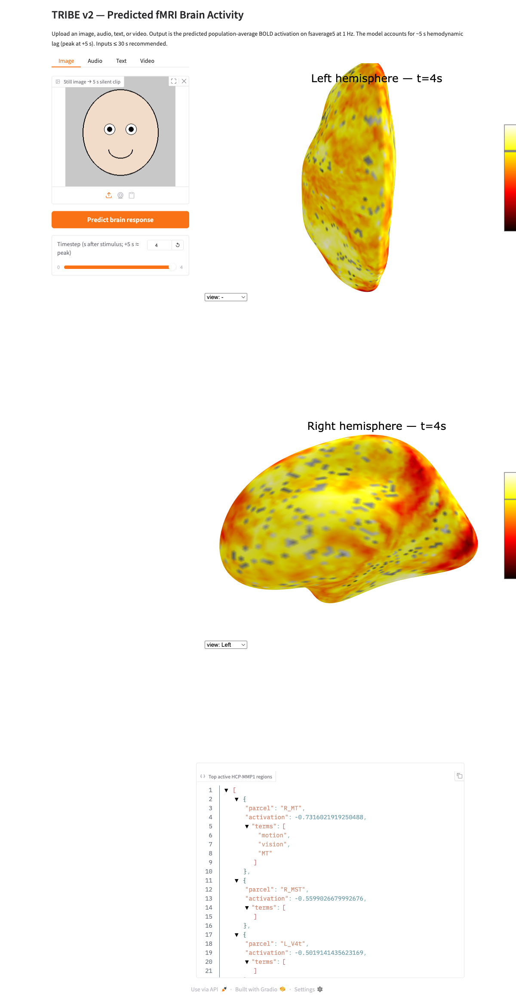
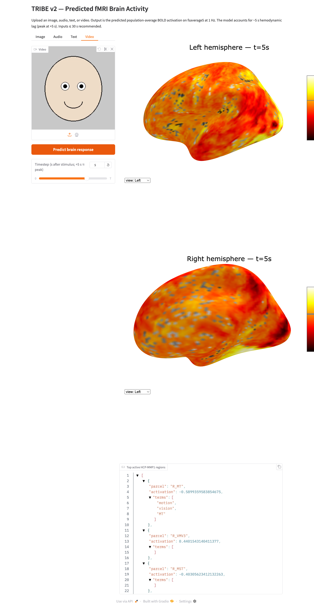
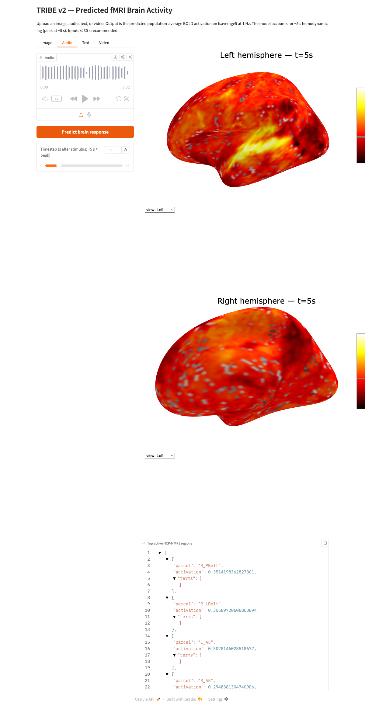

# total-tribe-v2

A self-hosted Gradio UI for Meta's TRIBE v2 brain-encoding model.

[](./LICENSE)
[](https://www.python.org/downloads/release/python-3120/)
[](#)

## What this is

`total-tribe-v2` wraps Meta FAIR's [TRIBE v2](https://huggingface.co/facebook/tribev2) brain-encoding model to predict whole-brain cortical activations (on the `fsaverage5` surface) from text, audio, or video stimuli. It runs entirely on a single 24 GB NVIDIA GPU and exposes a Gradio web UI with four input tabs (image, audio, text, video), a time slider, a brain renderer, and an interpretable region table. It is intended for research and education — not for clinical diagnosis, not for individual-subject inference.

## What this is NOT

- Not an LLM — it predicts fMRI BOLD activations, not text.
- Not for clinical use — no diagnostic or therapeutic claims.
- Not for individual subjects — predictions are population-averaged.
- Not for commercial use — CC-BY-NC-4.0 license applies (matches upstream).

## Quickstart

```bash
git clone <repo-url> total-tribe-v2
cd total-tribe-v2
cp .env.example .env
# Edit .env and set:
#   HF_TOKEN=<your_huggingface_token>
#   ENABLE_TEXT=true
# Then request access to the gated model:
#   https://huggingface.co/meta-llama/Llama-3.2-3B
docker compose up -d
```

Once the container is up, open <http://localhost:7860> in a browser. First run downloads the TRIBE v2 checkpoint and the LLaMA-3.2-3B weights (~tens of GB) into the persistent `cache/` volume; subsequent runs reuse them.

## Hardware

- **Minimum:** 1× NVIDIA GPU with 24 GB VRAM (RTX 3090 / RTX 4090 / A5000 or better)
- **Recommended:** same — there is no benefit to multi-GPU at inference (see [ADR-0002](./docs/DECISIONS/0002-single-gpu-placement.md))
- **Driver:** NVIDIA driver supporting CUDA 12.4+
- **Input duration cap:** ≤30 s of audio/video per request. This is the headroom we have under the 24 GB ceiling at peak (LLaMA + V-JEPA2 + W2v-BERT + fusion ≈ 23 GB; see [`docs/ARCHITECTURE.md`](./docs/ARCHITECTURE.md)).

## Screenshots

End-to-end smoke tests against the deployed UI, captured during the v0.1.0 first deploy:

| Modality | Top region | Screenshot |
| --- | --- | --- |
| Image (synthetic face → 5 s loop) | `R_MT` (motion / vision) |  |
| Video (8 s face clip) | `R_MT` + bilateral `R_VMV3` / `L_VMV3` (ventral visual) |  |
| Audio (32 s synthesized speech) | bilateral auditory cortex (`R_PBelt`, `R_LBelt`, `L/R_A5`, `L/R_A4`, `L_LBelt`, `R_TA2`) |  |

Each modality produces a neurally distinct, semantically appropriate signature on the fsaverage5 cortical surface. See [`CHANGELOG.md`](./CHANGELOG.md) for the full verification table.

## How it works

The browser sends a stimulus (text / audio / video — or an image that the client converts to a short video clip via MoviePy) to the Gradio server. The server materializes an events DataFrame, calls `TribeModel.predict()`, and returns a `(T, 20484)` `numpy` array of predicted activations on the fsaverage5 cortical surface. A renderer (nilearn `view_surf`) draws both hemispheres at a user-selectable timepoint, and a `RegionInterpreter` aggregates per-parcel activations against the HCP-MMP1 atlas to produce a top-K region table with Neurosynth-derived cognitive terms.

See [`docs/ARCHITECTURE.md`](./docs/ARCHITECTURE.md) for the full request lifecycle and component breakdown.

## Deployment

Deployed via [Dokploy](https://dokploy.com) on a single-GPU host. Routing, TLS, and basic-auth are configured in the Dokploy UI (not in `docker-compose.yml`) — see [ADR-0003](./docs/DECISIONS/0003-dokploy-ui-for-domains-and-auth.md). For a step-by-step deploy walkthrough (including a Claude Code MCP automation playbook), see [`docs/DEPLOYMENT.md`](./docs/DEPLOYMENT.md).

## License

This project is released under the **Creative Commons Attribution-NonCommercial 4.0 International License (CC-BY-NC-4.0)**. See [`LICENSE`](./LICENSE) for the full text.

**Non-commercial only.** This applies because upstream TRIBE v2 weights are CC-BY-NC. See LICENSE. If you have a commercial use case, you need to seek permission from Meta FAIR for the upstream weights independently — this wrapper does not and cannot relicense them.

## Citation

<!-- TODO: actual BibTeX once paper ID is known -->

```bibtex
@misc{tribev2_2025,
  title  = {TRIBE v2: a brain-encoding foundation model for naturalistic stimuli},
  author = {Meta FAIR},
  year   = {2025},
  note   = {Model card: https://huggingface.co/facebook/tribev2}
}
```

## Acknowledgments

- **Meta FAIR** — for [TRIBE v2](https://huggingface.co/facebook/tribev2), the model this UI wraps.
- **Glasser et al. 2016** — for the [HCP-MMP1](https://www.nature.com/articles/nature18933) multimodal cortical parcellation used in the region interpreter.
- **Neurosynth / NiMARE** — for the meta-analytic term database backing the cognitive-function lookups.
- **Forrest Chang** — for the Karpathy-style behavioral guidelines adapted in [`CLAUDE.md`](./CLAUDE.md).
